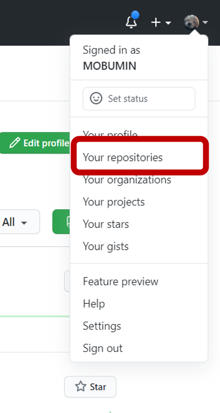
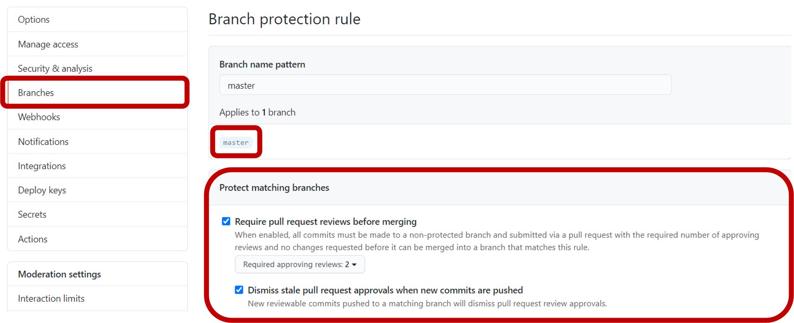
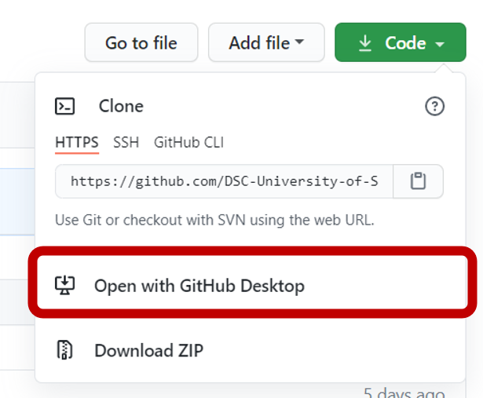
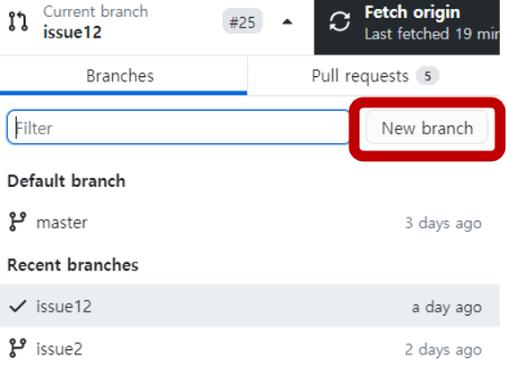
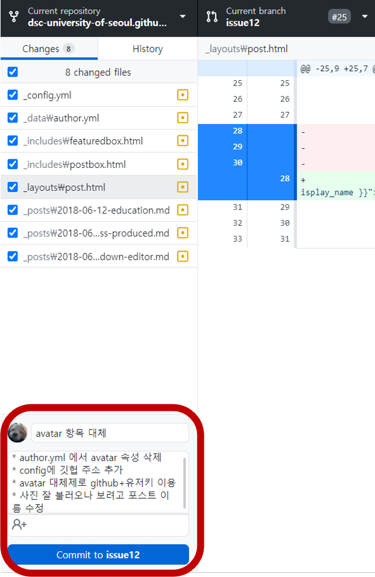

저는 이전까지 한 번도 제대로 된 협업이란 걸 해본 적이 없습니다. 전공 시간에 팀플할 때 처음으로 Git을 써 봤는데, 브랜치 한 번 바꿨다가 master 브랜치로 못 돌아가고, 수정사항이 여러개일때 commit이 안 되고, 한 사람은 애초에 commit을 할 수가 없었습니다. 그래서 결국 변경사항을 git으로 하는 게 아니라 메일이나 카톡으로 주고 받았습니다. 변경사항이 생길때마다 통째로 복붙해서 커밋했던 아련한 기억..

아직도 누구에게 뭘 알려줄 만한 위치는 아니지만, 저 때의 제가 Git에 대해 조금이라도 알았다면 하는 아쉬움에 포스트를 작성하게 되었습니다.

그래서 제 포스트는 과거의 저 같은 분들을 위한 포스트입니다. *매우 착한맛.*

준비물 : Github Desktop, Visual Studio Code

원래 개발 초보들은 개발 환경 다르면 따라 못하는 거 아시죠?(제 얘기입니다.) 그래서 준비물이라고 표현 했습니다. 저는 저 환경 기준으로 설명하겠습니다.

지금부터 저는 협업을 하는 경우를 크게 두 가지로 나누겠습니다. 본인이 직접 작업 환경을 만들어서 공유하는 것부터 시작해야하는 경우와, 이미 만들어진 환경에 들어가서 작업하는 경우.

## 1) 처음부터 뚝딱뚝딱 만들어서 해야하는 경우

이 경우는 Organization 을 만들어도 되지만, 간단한 방법으로 repository를 만들어서 그 레포에 collaborator를 추가하는 방식을 채택하겠습니다.

우측 상단의 profile을 눌러서 your repository를 클릭해주시고,

new 버튼을 클릭해서 repository 하나를 만들어주세요!

Repository Name은 원하시는 이름으로 설정하면 됩니다. Description에다가는 해당 repository에 대한 설명을 적어주세요!

처음 git을 접하셨으면 이 repository가 뭐지? 싶으실텐데, 간단하게 폴더랑 같은 맥락으로 이해하면 편합니다! 인터넷 바탕화면(=깃) 에 있는 폴더(=레포지토리) 같은 느낌.

그럼 이제 협업할 사람을 추가해야겠죠? Settings-Manage access에서 협업할 멤버들을 초대해주세요.

이제는 branch 설정을 조금 해줄게요. Settings-Branches에서 아래처럼 설정해주세요. Required Reviewer는 몇명의 승인을 받아야 하는지 정하는 거에요.

branch는 master에서 떨어져 나오는 아이입니다. master에서 잠깐 떼어내서 작업하고 다시 master랑 합칠 거에요!(merge) 2번에서 아주 약간 더 설명해드릴테니 일단 넘어가시죠..!

## 2) 이미 만들어진 공간에 들어가서 협업하면 되는 경우

자 이제는 작업 환경이 git에는 다 만들어졌으니, 해당 repository를 제 컴퓨터에 만들어줍시다! 제 로컬 환경에 있어야 무슨 작업이든 할 수 있겠죠?

repository의 클론 폴더를 제 컴퓨터에 만들어줄거에요! 아래 사진처럼 해줍니다.

이렇게 하면 여러분의 컴퓨터의 어딘가에 GitHub라는 폴더가 생성이 되고, 그곳에 여러분들이 방금 clone한 repository가 생성되어 있을 겁니다. 저 같은 경우는 `내PC/문서`에 생성되어 있었어요!

이제는 VScode로 협업만 하면 되겠네요!

이 상태로 그대로 이제 다 같이 master branch에서 작업해서 commit 해볼까요?

commit은 Git에 업로드한다는 느낌으로 이해하면 편합니다. 이전까지 작업은 Git에는 적용되지 않고, Local 환경에서만 바뀌었기 때문에 업로드를 해야 적용이 되겠죠?

그런데. **그렇게 하지 마세요!!!!** 다른 사람들과 다른 파일을 작업하면 괜찮을지 몰라도, 같은 파일을 작업할 경우 다른 사람이 Commit한 내역이 저에게 없으니 필연적으로 충돌이 일어납니다.

그래서 branch를 따로 만들 거에요. 현재의 master branch에서 잠깐 다른 줄기로 이동해서 작업을 하고, 다시 master branch와 합칠 거에요. 작업하는 사람들이 아닌 다른 사람들은 master branch의 모습만 보게 됩니다!

그럼 branch를 만들어 볼까요? Github Desktop에서 아래와 같이 해주세요.

아, branch를 만들기 전에, 제 local에 있는 master branch가 업데이트가 안 되어 있을 수도 있으니까 Github Desktop에서 pull을 미리 해줍시다.

branch 이름은 양식이 따로 있다면 그 양식을 따라 주시고, 없다면 다른 branch 이름 보고 눈치껏 지어줍시다.

혹시 모르고 master branch에서 이미 작업한 내역이 있나요? 그렇다면 아래 빨간 박스로 되어 있는 부분을 눌러서 변경 내역을 가져와주세요!

자, 이렇게 하면 이제 작은 issue를 해결할 저만의 branch가 만들어졌네요. 해당 branch로 열심히 작업하고 난 후, 이제 commit을 해볼까요?

과거의 저는, summary를 입력하지 않으면 commit을 못한다는 것을 몰랐습니다. 그래서 한 파일씩 commit 했던 기억이 나네요. 여러분들은 그러지 마세요...

이제 해당 commit을 원격 repository로 push 해줄거에요. commit은 제 local에서만 저장하는 거라면, push는 조금 더 멀리 보내는 느낌입니다.

push까지 하고 나면, Github Desktop에 아래 그림처럼 버튼이 생길 거에요. 눌러줍시다.

**base는 여러분들이 작업하는 repository로 꼭 바꿔주셔야합니다. 꼭이요! 꼭!** 안 그러면 다른데로 Pull Request를 보내게 돼요.

이제 팀 내의 다른 분들이 여러분들의 요청을 받아들여서 master와 merge(병합)할지, 아니면 변경을 요청할지 결정해주실 거에요!

### markdown 포스팅을 위한 약간의 팁

VScode를 사용하신다면, EXTENSIONS에서 markdownlint을 설치해주세요. 그러면 형식이 틀렸을 경우 노란 줄로 표시해줍니다!
