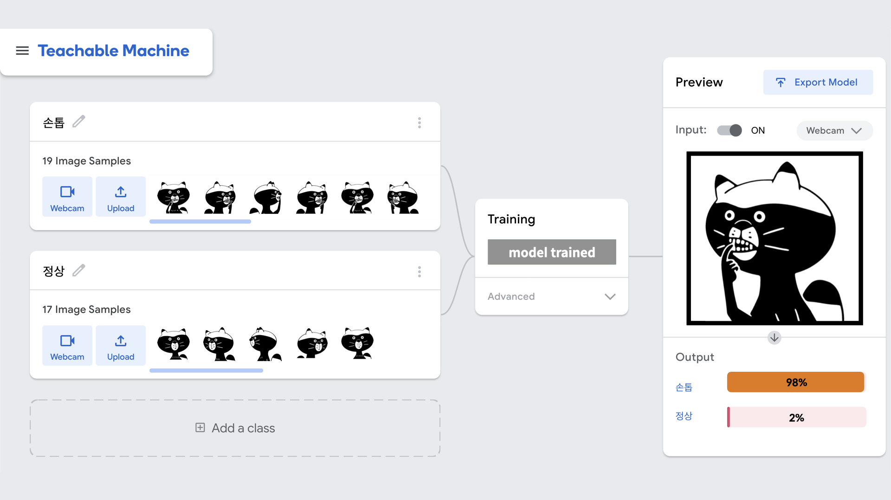

머신러닝이라는 것이 복잡하고 어려운 것만은 아니라고 저의 심리적 장벽을 낮춰준 것이 바로 Teachable Machine입니다. 이번 기회에 Teachable Machine을 공부한 내용을 기반으로 소개해보고자 합니다.  

##  Teachable Machine  

Teachable Mchine은 구글에서 제공하는 웹기반의 머신러닝 툴입니다. 여기서 머신 러닝 코드 없이 이미지, 소리, 포즈 자료를 업로드하여 인식 모델을 만들 수 있습니다. 기계 학습에 사전지식이 필요하지 않고, 툴의 이용이 쉽고 결과물을 빠르게 얻을 수 있다는 것이 특징입니다.   

## 원리  

Teachable Machine은 input받은 데이터를 미리 만들어진 신경망으로 전이학습을 시키는 것이기 때문에 복잡한 과정 없이 새로운 모델을 만들 수 있습니다. 다음은 teachable machine FAQ에 나오는 문장입니다.

“There’s a pretrained neural network, and when you create your own classes, you can sort of picture that your classes are becoming the last layer or step of the neural net.” [1](#footnote_1)

(전이학습 : 사전에 훈련된 모델의 가중치를 가지고 와서 새로운 case에 재보정해서 사용하는 것)

image, pose 프로젝트에는 MobileNet으로, audio 프로젝트에선 speech command recognizer[2](#footnote_2) 으로 미리 학습한 모델을 활용한다고 합니다. 

(MobileNet : CNN에서 convolution을 depthwise separable convolution로 변경해 파라미터 수를 줄여 모바일 환경에서도 운영 가능하게 가벼운 모델)

## 활용 방법(이미지 분류의 경우)

출처 : 생활코딩

1. 이미지를 업로드하거나, 웹캠을 통해 input 데이터를 만듭니다.
2. 최소 2개의 클래스에 해당하는 input을 업로드 후 train model을 눌러 모델일 형성되기까지를 기다립니다. 
3. 모델이 만들어진 후 우측에서 성능을 테스트합니다. 

### Advanced
 
가운데 training엔 advanced라고 모델 형성시 몇몇 부분을 조정할 수 있게 만들어두었습니다. 조정 가능한 항목은 epoch, batch size, learning rate입니다.  

Epoch는 전체 데이터를 몇번 사용해서 학습을 시킬지를 뜻합니다. epoch가 너무 커도 좋지 않은게 epoch가 높으면 과적합(overfitting)되어 새로운 데이터에 대한 예측률이 떨어질 수 있습니다.

Batch Size 한 번의 batch마다 주는 데이터 샘플의 크기를 뜻합니다. 여기서 batch는 나눠진 데이터 셋을 의미합니다. 메모리의 한계와 속도 저하의 문제로 모든 데이터를 한 번에 집어넣을 수 없어서 batch단위로 데이터를 투입하게 됩니다. 주로 16, 32, 64를 사용합니다.

Learning rate는 최적값을 찾아가는 속도로 보통 0.01로 맞춰 놓습니다. 학습 후 결과가 발산(overshooting)하면 작은 값을, 학습하는데 시간이 너무 오래 걸리면 큰 값으로 수정하면 됩니다. 

## 마무리

모델을 쉽게 만들 수 있는 만큼 섬세한 모델의 구현이 어려운 점은 있습니다. 저도 Teachable Machine을 이용해 가위, 바위, 보 인식 모델을 만들려고 했지만 손 모양의 구별은 어려웠습니다. 장단점이 존재하지만 이 글을 통해 다른 분들이 Teachable Machine을 접하고 머신 러닝에 관심을 가져보시면 좋을 것 같습니다.

<a name="footnote_1">1</a>: https://teachablemachine.withgoogle.com/faq  
<a name="footnote_2">2</a>: https://github.com/tensorflow/tfjs-models/tree/master/speech-commands