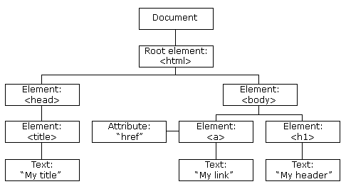
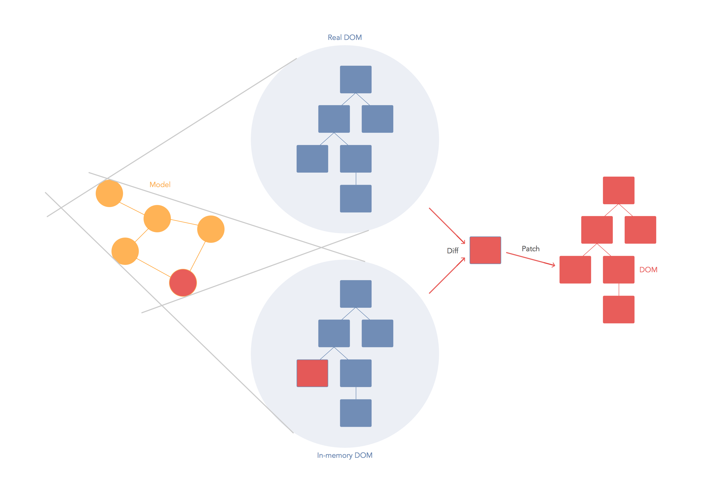
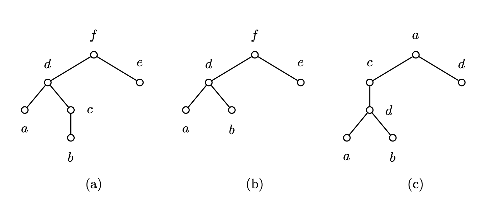

## Table of contents

1. DOM(Document Object Model)

2. VirtualDOM

3. 비교 알고리즘 (Diff Algorithm)

## DOM (Document Object Model)

 문서 객체 모델(Document Object Model, DOM)은 HTML, XML 문서의 객체 모델이다. DOM을 이용하여 문서의 구성을 객체로 표현하는 것이 가능하다. DOM을 이용하여 객체로 변환한 문서는 스크립팅 언어를 통하여 조작이 가능하며, 웹 브라우저 또는 다른 프로그래밍 언어에서 표현되는 방식을 제공한다.

다음은 HTML 문서를 브라우저에서 변환한 DOM 트리의 예시이다.

 ```HTML
 <!doctype html> 
 <HTML>
    <head>
      <title>My title</title>
   </head>
   <body>
     <a href="/">My link</a>
     <h1>My header</h1>
   </body>
 </HTML>
 ```

위 코드는 DOM 트리로 표현이 가능히다.


*w3schools.com*

이러한 변환은 브라우저의 렌더링 엔진에서 발생한다. 렌더링 엔진은 브라우저의 구성 요소이며, 클라이언트가 브라우저에 요청한 타입의 문서를 화면에 표현하는 기능을 한다. 이 과정에서 문서를 DOM으로 변환하게 되는데, 세부적인 동작의 예시(Webkit 렌더링 엔진)는 다음과 같다.


*How Browsers Work: Behind the scenes of modern web browsers by Tali Garsiel and Paul Irish*

HTML로 작성된 문서는 먼저 HTML 파서에 의해 파싱된다. 파서는 HTML 문서를 브라우저가 이해할 수 있는 문법 트리(Syntax Tree) DOM으로 파싱한다. 독립적으로 브라우저는 CSS 파서를 통해 CSS 파일을 파싱한다. DOM 트리를 구축하는 동안, HTML 요소의 스타일 속성을 계산하여 DOM 트리의 노드가 브라우저에 표현되는 방식과 위치를 결정하고 렌더 트리를 생성한다(Reflow). 렌더 트리의 시각 정보를 클라이언트가 볼 수 있도록 그리는 과정을 끝으로(Painting), HTML 문서는 클라이언트의 시각 정보로 변환된다.

대부분의 웹 사이트는 정적인 화면을 한번 보이는 것으로 동작을 끝내지 않는다. 클라이언트로부터 여러번 요청을 받아 여러 HTML 문서를 변경하며 화면에 표현할 뿐 아니라, 대화형 웹(Interactive Web) 같이 단일 페이지에서 수시로 뷰가 변경되기도 한다.

위 플로우차트와 같이 동작하는 렌더링 엔진에서는 DOM 트리가 수정되어 렌더 트리가 재구성되어야 하거나(Reflow) 브라우저의 화면을 구성하는 노드의 스타일이 변경되는 경우(Repaint) 렌더링을 다시 수행한다. 따라서 최적화를 잘 하지 않으면 작은 변화에도 반복적으로 렌더링을 수행하기 때문에 성능 저하가 발생한다. DOM이 수정되어야 하는 영역을 배치(batch)로 만들어 리페인팅을 최소화하는 것이 예시가 될 수 있는데, 리액트는 Virtual DOM을 사용하여 이 과정을 추상화한다.

## Virtual DOM

Virtual DOM은 DOM과 HTML 문서 사이에 존재하는 버퍼와 유사한 것으로 생각할 수 있다. 리액트의 경우, 메모리에 DOM을 복제한 Virtual DOM을 보관한다. DOM의 변경이 필요한 상황이 오면 먼저 Virtual DOM 트리를 수정한다. 그 후 비교 알고리즘(Diff Algorithm)을 통해 Virtual DOM과 실제 DOM의 차이를 계산하여 변경사항을 배치로 만든다(Reconciliation). 만들어진 배치를 실제 DOM에 적용시킨다.

Virtual DOM을 이용하지 않아도, DOM이 변경될 부분을 직접 배치로 만들어 리페인팅을 최소화 할 수도 있다. 이 경우 Virtual DOM을 보관하는 메모리 공간과 Virtual DOM과 실제 DOM을 비교하는 시간(DOM이 변경될 부분을 효율적으로 계산한다고 가정)을 아낄 수 있기 때문에 Virtual DOM을 이용하는 것 보다 더 효율적이다. 하지만 Virtual DOM을 이용하면 이러한 최적화 과정을 자동으로, 예측 가능하도록 추상화하며 실제 DOM을 직접 조작하는 것과 '거의' 비슷한 속도로 동작하기 때문에 개발자의 편의를 위해 사용한다.


*React Virtual DOM vs Incremental DOM vs Ember’s Glimmer: Fight by Sebastian Peyrott*

다음 HTML을 통해 만들어진 DOM을 자바스크립트를 통해 업데이트하는 것을 생각해보자.

 ```HTML
<!doctype html> 
<HTML>
   <head>
     <title>My title</title>
  </head>
  <body>
    <div id="root">
      <a href="/">My link</a>
      <h1 id="header">My header</h1>
      <p id="paragraph">Text</p>
    </div>
  </body>
</HTML>
 ```

```javascript
document.querySelector('#header').innerHTML = "New header"
document.querySelector('#paragraph').innerHTML = "New Text"
```

이러한 방법으로 DOM을 업데이트 하는 경우 렌더 트리는 두번 변화한다. 그러나 Virtual DOM을 이용하면 비교 알고리즘을 통해 DOM의 서브트리(h1, p 태그를 표현하는 노드)를 수정하므로 더 효율적이다.

## 비교 알고리즘 (Diff Algorithm)

Virtual DOM의 오버헤드는 비교 알고리즘이 많은 부분을 차지한다. Virtual DOM 트리와 실제 DOM 트리 비교 연산이 새롭게 DOM 트리를 구축하고 렌더링하는 것 보다 더 많은 시간을 소모한다면 Virtual DOM은 메모리와 시간 모두 낭비하게 된다.

Virtual DOM과 DOM 모두 트리 형태를 가진다. 두 트리를 비교하는 여러 문제 중 편집 거리 알고리즘(Edit Distance Algorithm)을 사용하여 두 트리를 비교할 수 있다.

트리 편집 거리 문제(Tree Edit Distance Problem)은 두 트리 T1, T2에 대해서 T1이 T2가 되기 위한 모든 편집 연산의 비용 합을 구하는 문제이다. 이때 편집 연산은 트리를 구성하는 노드에 대해 재명명(Relabeling), 삭제(Deleting), 삽입(Inserting) 세 가지 연산을 의미한다. 트리 편집 거리 문제의 하나의 해답은 아래와 같다.


*A Survey on Tree Edit Distance and Related Problems, Figure 2*

트리 (a)를 트리 (c)로 변환하고자 한다. 먼저 트리의 노드 c를 삭제한다(트리 (b)). 노드 c를 노드 a와 노드 d사이에 삽입하고 노드 f를 a로, 노드 d를 e로 재명명한다. 각 편집 연산에 비용 함수(Cost Function)을 정의하였을 때 변환의 총 비용을 최소화하는 연산의 집합을 최적 편집 스크립트(Optimal Edit Script)라고 한다.

트리 편집 거리 문제에 대한 좋은 알고리즘중 하나는 Zhang and Shasha의 알고리즘으로 알려져 있다. 해당 알고리즘을 간단하게 소개하면, 정렬된 트리에 대해 keyroots를 트리의 루트 노드와 왼쪽 형제가 있는 노드의 집합으로 정의한다. 노드 v가 keyroots에 포함되는 경우 v에 대한 서브트리는 재귀적으로 전체 트리에 대한 문제와 같은 방식으로 풀 수 있다. 이때 v에 대한 서브트리를 연관된 부분 문제(relevant subproblem)라고 부른다. 정렬된 트리에 대해서 연관된 부분 문제의 수는 O(|T|cdepth(T)) 를 넘지 못한다(|T|: 트리의 전체 노드 수, cdepth(v): 노드 v에 대한 keyroots에 포함되는 조상의 수, cdepth(T): 트리 T에 포함된 모든 노드 v에 대한 cdepth(v) 값 중 가장 큰 값). 트리 T에 대해서 cdepth(T)의 값은 트리 T의 깊이 또는 리프 노드 수 보다 작거나 같다. 동적 프로그래밍 기법을 통해 반복했을 때 트리 편집 거리 문제는 O(|T1||T2| min {Depth(T1), Leaves(T1)} min {Depth(T2), Leaves(T2)}) 시간 안에 해결할 수 있다.

이 아이디어에서 P.N. Klein이 발전시킨 알고리즘이 트리 편집 거리 문제의 SOTA 알고리즘으로 알려져 있으며, O(|T1|^2|T2|log(|T2|) 시간 내에 두 트리의 비교가 가능하다. 두 알고리즘의 자세한 구현은 다음 페이지에서 확인이 가능하다. [Zhang and Shasha's Algorithm](http://www.grantjenks.com/wiki/_media/ideas/simple_fast_algorithms_for_the_editing_distance_between_tree_and_related_problems.pdf) [Klein's Algorithm](http://citeseerx.ist.psu.edu/viewdoc/download;jsessionid=65513FA97EB55AACB6637F9002748C1C?doi=10.1.1.186.5624&rep=rep1&type=pdf)

일반적으로 두 트리의 노드의 개수가 n으로 동일하다고 생각하면 O(n^3)의 시간이 걸린다고 생각이 가능하다. 위와 같은 트리 비교 알고리즘을 바로 DOM 트리와 Virtual DOM 트리의 비교에 적용하면 엘리먼트의 개수에 따라 비교 시간이 지수적으로 증가하기에 처음부터 DOM 트리를 구축해 다시 렌더링하는 것에 비해 Virtual DOM을 사용하는 이점을 잃는다.

실제 DOM 트리와 Virtual DOM 트리의 경우 트리의 형태가 일정 수준 규칙성을 가지므로, 리액트는 위와 같은 문제를 해결하기 위해 휴리스틱을 비교 알고리즘에 적용한다. 서로 다른 타입의 두 엘리먼트는 서로 다른 트리를 만들어내고, 개발자가 key prop을 통해 여러 렌더링 사이에서 어떤 자식 엘리먼트가 변경되지 않아야 할지 표시해 주는 것으로 O(n) 의 시간 복잡도 내에서 비교가 가능하다.

루트 엘리먼트 타입이 변경되었지만 그 엘리먼트의 자식 엘리먼트가 이전과 동일한 경우는 많지 않다. 따라서 루트 엘리먼트의 타입이 다른 두 서브트리를 비교할 때 리액트는 이전 트리를 버리고 새로운 트리를 구축한다. 또한 서브트리 내에서 동일한 높이에 있는 엘리먼트를 비교할 때는 각 엘리먼트에 key를 부여하여 변경되거나 제거된 엘리먼트를 상수 시간 내에 찾을 수 있다. Virtual DOM 트리의 각 엘리먼트와 실제 DOM(이전 상태)의 엘리먼트를 대치하는 것은 대부분의 경우 상수 시간의 수행 속도를 가지므로 전체 Virtual DOM 엘리먼트와 실제 DOM 의 차이는 O(n) 시간으로 비교할 수 있다.

결론적으로 Virtual DOM을 이용하면 실제 DOM에 많은 신경을 쓰지 않고도 직접 DOM을 제어하는 것에 크게 부족하지 않은 성능을 가진 어플리케이션을 개발할 수 있기 때문에 유용하다.

## References

`https://developer.mozilla.org/ko/docs/Web/API/Document_Object_Model/Introduction`

`https://ko.reactjs.org/docs/reconciliation.html`

`https://d2.naver.com/helloworld/59361`

P.N. Klein. Computing the edit-distance between unrooted ordered trees. In Proceedings of the 6th annual European Symposium on Algorithms (ESA) 1998., pages 91–102. Springer-Verlag, 1998.

Kaizhong Zhang and Dennis Shasha. Simple fast algorithms for the editing distance between trees and related problems. SIAM Journal of Computing, 18:1245–1262, 1989.
