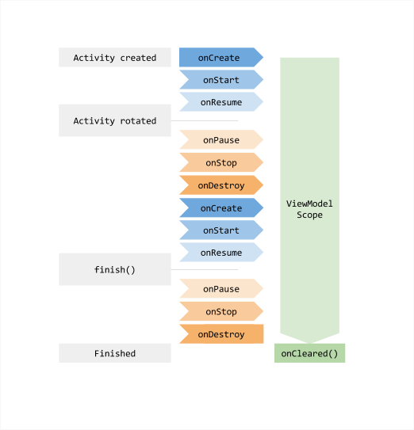
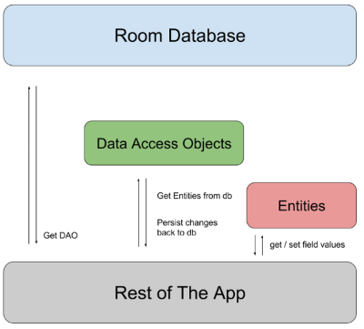

## intro

안드로이드 AAC에 대해 알아보는 포스트를 작성해보려 합니다.

저는 아는 게 많이 부족합니다. (사실 할 줄 아는 게 없어요 ㅠ)
그래서 이번 10월 모바일 포스팅을 통해 안드로이드 개발의 큰 그림, 요즘 트렌드 등을 알 수 있으면 좋겠다는 생각이 듭니다.

## AAC가 뭘까요

AAC(Android Architecture Components)는 테스트와 유지보수가 쉬운 앱을 디자인할 수 있도록 돕는 라이브러리의 모음입니다.

## 안드로이드 아키텍처 (AAC)의 원칙 <관심사 분리, 모델에서 UI만들기>

AAC에 대한 조사를 하다보니, 앱 아키텍처 원칙이란 게 있어 이 또한 정리해보려고 합니다.

코드를 작성할 때 Activity, Fragment와 같은 UI 기반의 클래스는 UI 및 OS 상호작용을 처리하는 로직만 포함해야 한다고 해요.
이는 UI 클래스를 최대한 가볍게 유지해, LIFECYCLE 관련 문제를 피하기 위함입니다.

요약하면 UI 클래스로부터 UI, OS 상호작용을 제외한 다른 로직을 분리해 UI 클래스에 대한 의존성을 최소화 하는 게 앱 관리 측면에서 좋다는 것입니다.

또, UI는 모델에서 만들어져야 한다고 합니다.
Model은 앱의 데이터 처리를 담당하는 컴포넌트로, 앱의 view 객체 및 앱 컴포넌트와 독립되어 있어 앱의 life cycle에 영향을 받지 않습니다.

model은 가급적이면 지속적인 model을 사용하는 게 좋은데,
지속 model을 사용하면 os에서 리소스 확보를 위해 앱을 제거해도 사용자 데이터가 삭제되지 않고 네트워크에 문제가 있어도 앱이 계속 작동할 수 있기 때문입니다.

## 안드로이드 아키텍처(AAC) 구성요소

안드로이드 아키텍처 구성요소엔 view model, livedata, room, databinding 이 있습니다.

## View model

viewmodel은 앱의 lifecycle을 고려해, ui 관련 데이터를 저장, 관리하는 컴포넌트 입니다.
UI를 관리하는 UI Controller에 과도한 역할을 부여하면 과부하가 올 수 있고, 테스트 또한 어려워집니다.
따라서 ui 관리시 view data 소유권을 분리하는 방법이 더 쉽고 효율적이라는 점을 이용한 게 viewmodel 이라고 해요~

viewmodelprovider가 viewmodel에 lifecycle을 전달하며 viewmodel은 lifecycle이 끝날 때까지 메모리에 남아있습니다.

## LiveData

LiveData는 식별 가능한 데이터 홀더 클래스로, 다른 앱 컴포넌트의 lifecycle을 인식하며 이를 통해 활성 상태에 있는 앱 컴포넌트 옵저버에게만 업데이트 정보를 알립니다.

LiveData를 사용은 다양한 이점을 갖고 있습니다.

UI와 데이터 상태의 일치 보장, 메모리 누수 없음, 중지된 활동으로 인한 비정상 종료 없음, LIFECYCLE을 더 이상 수동으로 처리하지 않음, 최신 데이터 유지, 적절한 구성 변경, 리소스 공유 가 바로 LIVEDATA사용의 이점이라 합니다!

## Room

Room 라이브러리는 SQlite에 추상화 레이어를 제공하여 원활한 DB 액세스를 지원하고 SQLite를 완벽히 활용할 수 있게 하는 라이브러리입니다.

Room 라이브러리를 사용하면 앱을 실행하는 기기에서 앱 데이터의 캐시를 만들 수 있고, 이 캐시를 통해 사용자는 인터넷 연결 여부와 관계없이 앱에 있는 주요 정보를 일관된 형태로 볼 수 있다고 합니다.

구성요소엔 database( 데이터 베이스 홀더를 포함하고 데이터에 연결하기 위한 역할을 함), entity (데이터 베이스 내의 테이블), DAO(Data access object, 데이터 베이스에 접근할 때 사용되는 메소드를 포함)가 있습니다

애플리케이션은 room 데이터 베이스를 사용해 DAO를 가져옵니다. 이후 DAO를 사용해 데이터 베이스에서 Entity를 가져오고 변경사항을 데이터베이스에 다시 저장합니다.

## Databinding

Databinding은 선언형으로 레이아웃의 UI 구성요소를 앱의 데이터와 결합할 수 있도록 지원하는 라이브러리 입니다. 데이터를 XML 파일에서 처리할 수 있음으로 편리합니다.
Databinding을 사용하면 코드가 단순해지고, 메모리 누수가 방지된다는 장점이 있습니다.

## 마치면서

GDSC에 들어온지 얼마 되지 않았다보니 글을 쓰기 전부터도, 쓰면서도 여러가지 어려움이 있었던 거 같습니다.
(뭐가 뭔지 잘 모르는 사람의 문제점이 뭘까요? 제 개인적인 의견으론, 뭘 모르는지 뭘 아는지도 잘 파악을 못한다는 것입니다.)

이번 포스팅을 쓰기위해 조사하면서 AAC에 대해 알아보는 시간을 가졌음에도 불구하고.. 많이 부족하고, 완벽히 이해가 되지 않았습니다.
그래도 아무것도 하지 않은 것보단 이렇게 알아가는 과정 속에서 하나라도 배운 게 있을 것이라고 굳게 믿도록 하겠습니다. ㅎㅎ.
그리고 언젠간 제가 알게 된 내용을 잘 적용하는 날이 오겠죠? 와야합니다 ㅠ

## 참고자료

1. [안드로이드 아키텍처 구성요소](https://developer.android.com/topic/libraries/architecture?hl=ko)

2. [[Android] 안드로이드 아키텍쳐 컴포넌트(AAC) - LiveData, Databinding, Room, ViewModel](https://4z7l.github.io/2020/09/21/android-aac.html)

3. [[Android] 안드로이드 AAC](https://velog.io/@hwi_chance/Android-%EC%95%88%EB%93%9C%EB%A1%9C%EC%9D%B4%EB%93%9C-AAC)
