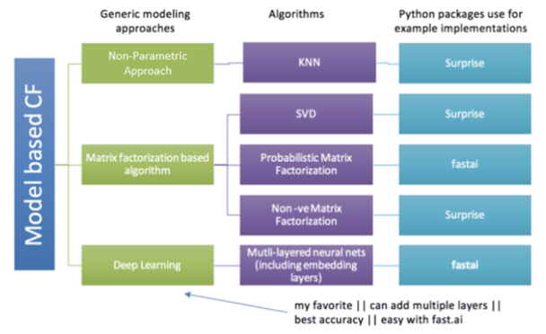
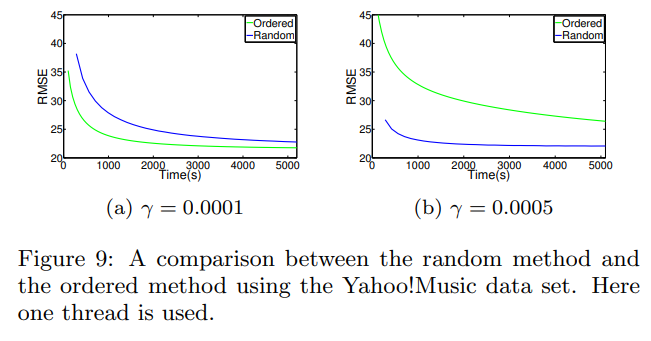
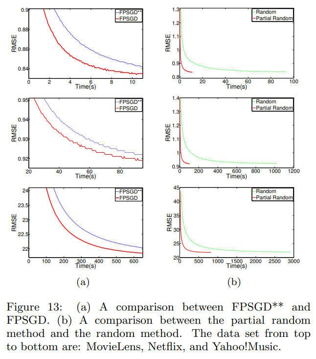

# 들어가며
[추천시스템 학회](https://recsys.acm.org/)를 둘러보다가 <b>A fast parallel SGD for matrix factorization in shared memory systems</b>라는 논문을 읽어봤습니다.
본 논문은 공유 메모리 시스템을 위해 확률적 경사 하강법(SGD)을 병렬로 처리한 방법으로서 FPSGD(Fast Parallel SGD)를 소개합니다. FPSGD는 cache-miss rate를 줄이고 스레드의 balance를 신중하게 처리함으로써 기존의 MF방식보다 더 효율적입니다.

## Matrix Factorization
본격적인 포스팅에 앞서 Matrix Factorization 방식이 무엇인지 먼저 설명하고자 합니다.



[지난 포스팅](https://gdsc-university-of-seoul.github.io/Youtube-Algorithm/)에서 협업 필터링(Collaborative Filtering, CF) 알고리즘에 대해 잠깐 설명하였습니다. 행렬 요인화(Matrix Factorization, MF)방식이란 협업 필터링의 종류 중 하나인 model-based CF의 한 갈래로, rating matrix를 사용하여 모델을 학습시키는 방식입니다.

### Matrix Factorization(MF) 방식의 원리
MF 방식은 사용자와 아이템으로 구성된 하나의 행렬을 2개의 행렬로 분해하는 방법입니다. 
아래 그림에서 R은 사용자와 아이템으로 이루어진 rating matrix입니다. 이는 M명의 사용자가 N개의 아이템에 대해 평가한 데이터를 포함하고 있는 2차원 행렬입니다. 행렬의 각 원소는 사용자가 아이템에 대해 평가한 평점만을 가지고 있으며, 그 외의 값은 결측치로 이루어져 있습니다.
>결측치가 많은 행렬을 sparse matrix라고 합니다.


Rating matrix R을 사용자 행렬 P, 아이템 행렬 Q로 쪼개어 분석하는 것이 MF 방식입니다. $P\times{Q}^T = \hat{R}$ 을 통해 R의 예측 값인 $\hat{R}$ 을 구하게 되는데, 여기서 $\hat{R}$ 이 $R$ 과 최대한 가까운 값을 가지도록 하는 $P$ 와 $Q$ 를 구하는 것이 목적입니다. 이 알고리즘을 개념적으로 설명하면 다음과 같습니다.
1. 잠재요인의 개수인 K를 정한다.
2. 주어진 K에 따라 $P(M\times{K})$ 와 $Q(N\times{K})$ 행렬을 만들고 초기화 한다.
3. 주어진 P, Q 행렬을 사용해서 예측 평점 $\hat{R}$ 을 구한다.
4. $R$ 의 값과 예측 평점 $\hat{R}$ 를 비교하여 오차를 구하고, 이 오차를 줄이기 위해 $P, Q$ 값을 수정한다.
5. 3, 4를 반복하여 최적의 값을 찾는다.

아래는 위의 알고리즘을 간단히 코드화 한 것입니다. ~~가독성을 위해 필요한 부분만 작성하였습니다.~~
```python
class MF():
    def __init__(self, ratings, K, alpha, beta, iterations, verbose=True):
        .           # 변수를 클래스에 저장

    def rmse(self):
        .           # Root Mean Squared Error (RMSE) 계산
        return np.sqrt(np.mean(self.errors**2))

    def train(self): 
        .           # Initializing user-feature and item-feature matrix
        .           # Initializing the bias terms
        .           # List of training samples
        .           # Stochastic gradient descent for given number of iterations
        return training_process

    def get_prediction(self, i, j):
        .           # Rating prediction for user i and item j
        return prediction

    def sgd(self):
        .           # Stochastic gradient descent to get optimized P and Q matrix


# 전체 데이터 사용 MF
mf = MF(R_temp, K, alpha, beta, iterations, verbose=True)
train_process = mf.train()
```
> 참고: python을 이용한 개인화 추천시스템 (저자: 임일)

위 코드처럼 일반적으로 오리지널 $R$ 값과 $\hat{R}$ 값 사이의 오차를 줄이기 위해 SGD(Stochastic gradient descent)을 종종 사용합니다.
오늘 소개할 내용이 바로 이것입니다. 

## Parallel Stochastic Gradient Descent
FPSGD가 소개되기 이전 PSGD에 대한 연구는 많이 진행되었습니다. 본 논문에서 소개한 방식은 다음과 같습니다.
1. HogWild
2. DSGD

간단히 설명하지면 HogWild 방식은 각 스레드에서 하나의 SGD 작업을 담당하며 이를 병렬적으로 동시에 처리하는 방식입니다. 이 알고리즘을 Pseudo code로 표현하면 다음과 같습니다.

```
for each thread i parallely do
    while true do
        randomly select an instance r from R
        update corresponding p and q using sgd, respectively
    end while
end for
```

DSGD 방식 또한 SGD를 병렬적으로 처리하는 방식입니다. 먼저 Rating matrix를 스레드의 개수인 s개 만큼의 sub-matrix로 나눕니다. 그런 다음 서로 독립적인 block에 대하여 sgd 작업을 실행합니다. 이 알고리즘을 Pseudo code로 표현하면 다음과 같습니다.

```
grid R into s by s blocks B and generate s patterns covering all blocks
for t = {1, ... , T} do
    Decide the order of s patterns sequentially or by random permutation
    for each patterns of s independent blocks of B do
        assign s selected blocks to s threads
        for b = {1, ..., s} parallelly do
            randomly sample ratings from block b
            apply sgd on all sampled ratings
        end for
    end for
end for
```

두 알고리즘 모두 유용하고 유명한 알고리즘이지만 공유 메모리 시스템(shared memory system)에서 사용하기에 몇 가지 단점이 있었습니다.

1. Locking Problem

    스레드가 다른 스레드의 작업이 끝날 때까지 기다리는 현상을 말합니다.
    병렬 알고리즘의 경우에 모든 스레드가 놀지 않고 일을 하는것이 중요합니다. 하지만 DSGD의 경우를 보면 s개의 상호 독립적인 블럭이 동시에 sgd update가 진행되게 되는데, 각 블럭에 대한 작업의 실행 시간이 모두 다르기 때문에 작업이 일찍 끝난 스레드의 경우에는 다른 스레드의 작업이 끝날 때까지 기다려야 한다는 단점이 있었습니다. 

    

    위의 그림을 보면 블럭(0,0)에는 9개의 rating이 존재하며 블럭(1,1)에는 3개의 rating이 존재합니다. 즉, 블럭(1,1)을 담당하는 스레드가 작업이 끝나도 블럭(0,0)이 담당하는 스레드는 아직 작업이 $1\over{3}$ 밖에 끝나지 않습니다.
    
    특히, 현실에서 접하는 Rating matrix의 경우는 매우 sparse하기 때문에 값들이 불균형하게 분포해있을 가능성이 높습니다. 따라서, 특정 블럭에 rating 값이 몰려 있다면 그 블럭을 담당한 스레드의 작업 시간이 더 길어지게 되어 전체적인 성능 저하를 불러옵니다.

    rating이 불균형한 점은 *random shuffling* 방식으로 해결할 수 있는 것처럼 보이지만 *random shuffling* 을 취해도 rating이 골고루 분포하지 않을 수 있다는 문제가 있었고, rating이 골고루 분포하고 있다고 해도 각 block에 대한 작업 시간이 여전이 조금씩 다르다는 문제가 있었습니다.

2. Memory Discontinuity

    프로그램에 메모리에 불연속적으로 접근한다면 cache-miss rate가 증가하며 이는 전체적인 성능 저하로 이어집니다. HogWild와 DSGD를 포함한 대부분의 MF방식은 R로부터 랜덤하게 rating을 추출하여 sgd를 진행합니다. 

    

## Fast Parallel Stochastic Gradient Descent
본 논문에서는 locking problem과 memory discontinuity를 해결하기 위해 각각 *lock-free scheduling*, *partial random method* 를 제시하였습니다.

### Lock-Free Scheduling
본 논문에서는 DSGD의 Griding 방식을 참고하여 스케쥴러가 스레드를 계속해서 작업하도록 하는 방식을 소개하였습니다. DSGD에서는 R을 스레드의 개수만큼 sub-matrix를 만들어 각 스레드가 이를 담당하게 하였지만 FPSGD는 R을 최소 (s+1)개의 sub-matrix로 나누었습니다. 그런 다음 각 스레드가 작업이 끝나면 스케쥴러는 다음 조건에 따라 작업할 block을 스레드에게 할당하였습니다.

1. *free block* 인가?
2. 해당 block이 업데이트된 횟수가 제일 적은가?

>*free block*은 작업중인 블럭들로부터 독립적인 block을 뜻합니다. 


위 그림에서 (a)그림은 DSGD처럼 s개의 block으로 나눈 것이고 (b)는 FPSGD처럼 (s+1)개 이상으로 나누었을 때를 나타냅니다. (a)의 경우에는 T2가 작업이 끝나도 다른 블럭들은 T1블럭과 Dependent하기 때문에 T1의 작업이 끝날 때까지 기다려야 합니다.
하지만 (b)그림에서는 T2가 작업이 끝나고 T1의 작업이 진행중이더라도 여전히 3개의 *free block*이 존재합니다. 따라서 스레드는 쉬지 않고 작업을 진행할 수 있습니다.

또, 2번 조건에 따라 스케쥴러가 잘 작동하고 있는지는 다음 식을 통해 판단하였습니다.

$$ DoI = {UT_M(t) - UT_m(t) \over {t}} $$

$UT_M(t)$ 는 각 블럭 중에서 t번 반복 동안 진행됐던 업데이트의 최대 횟수를 뜻하고, $UT_m(t)$ 는 각 블럭 중에서 t번 반복 동안 진행됐던 업데이트의 최소 횟수를 뜻합니다.

DoI를 실제 데이터셋에 대해 적용해 본 결과 다음과 같았습니다.


이는 스케쥴러가 2번 조건을 잘 수행하고 있다는 것을 뜻합니다.

### Partial Random Method


Memory discontinuity 문제를 해결하기 위해 본 논문에서는 r을 랜덤하게 선택하는 것 대신에 r을 순서대로 선택하는 방식을 취하였습니다. 그 결과 연속적으로 데이터에 접근할 수 있었지만 성능이 불안정하였습니다.


이에 본 논문에서는 두 방식을 혼합하는 방식을 제시하였습니다. 즉, 블럭을 랜덤하게 선택하는 대신 블럭 내에서 rating을 순서대로 선택하게 함으로써 데이터의 연속성과 수렴 속도를 동시에 해결할 수 있었다고 합니다. 

### Overview of FPSGD
즉 전체적인 알고리즘을 살펴보면 다음과 같습니다.

1. R을 랜덤하게 섞어 데이터의 불균형을 해소한다.
2. R을 최소한 (s+1)개 이상의 sub-matrix로 나눈다.
3. 각 블럭을 유저 or 아이템 순서대로 정렬한다.
4. scheduler에 따라 스레드를 실행시킨다.

### Results

> FPSGD**: Lock-free scheduling 대신 DSGD방식을 적용한 FPSGD입니다.

간단하게 결과를 살펴보겠습니다. 
그래프 (a)를 보면 확실히 FPSGD가 더 나은 RMSE값을 가지는 것으로 볼 수 있습니다.
또, 그래프 (b)를 보면 두 방법 모두 비슷한 RMSE에 도달하기는 했지만 무작위로 r을 선택하는 것보다 partial random method가 수렴 속도 측면에서 우수하다는 것을 볼 수 있습니다.
