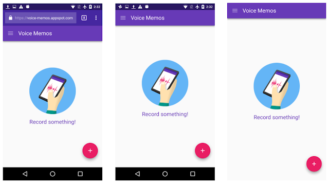
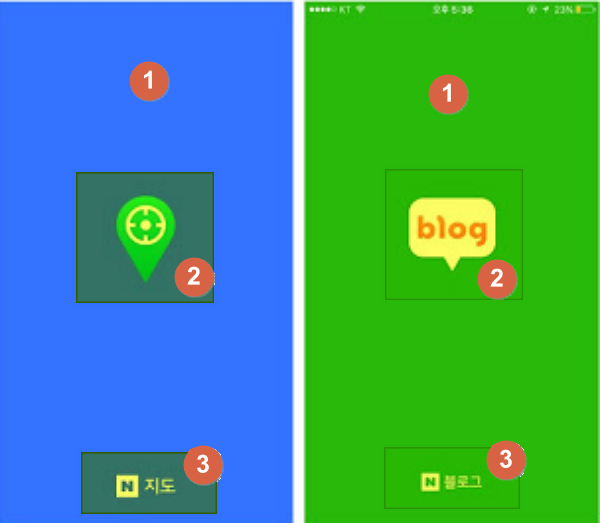

## INTRO

> 2022년 웹 개발 트렌드 PWA?

스마트폰에서 앱은 우리 일상생활에서 큰 역할을 하고 있으며 많은 비중을 차지하고 있습니다.  
그와 함께 앱은 계속해서 우리들의 일상에서 중요한 역할을 하고 있습니다. 하지만 **Native App**을 개발하고 유지 보수하는 것은 상당히 길고 복잡한 과정이며, 큰 비용이 드는 경우도 많습니다.  
이런 이유로 기존에 웹사이트를 운영하고 있는 기업들은 우리가 웹에서 사용하는 기술과 **Native App**의 장점을 결합합니다. 그것이 바로 **Rrogressive Web App**, 줄여서 **PWA**라고 부르는 것입니다.

이번 포스팅에서는 **PWA**에 대해 알아보도록 하겠습니다.

## PWA란 무엇인가?

**PWA**는 **'Progressive Web App'** 의 줄인 말로, 모바일 사이트에서 **Native App**과 같은 사용자 경험을 제공하는 웹과 앱 모두의 장점을 결합한 제품입니다.  
**PWA**는 우리 모두가 알고 있고 좋아하는 `HTML`, `CSS`, `JavaScript`와 같은 웹 기술로 만드는 앱입니다.  

몇 가지의 스마트한 기능들을 추가하면, 세상의 그 어떤 웹사이트라도 **PWA**로 바꿀 수 있습니다.  
즉, **Native App**을 개발하는 것은 상당히 어렵지만, **PWA**는 훨씬 더 빠르게 개발할 수 있다는 것입니다. 또한, 푸시 알림이나 오프라인 지원과 같은 **Native App**의 특징들도 전부 제공할 수 있습니다.  

우리가 온라인에서 볼 수 있는 많은 사이트들도 실제로는 **PWA**입니다. 예로 [트위터](twitter.com)가 대표적입니다.  
스마트폰에 저장된 트위터 사이트를 열어 보면, 모양도 **Native App**처럼 보이고, 기능도 모두 똑같습니다. 아이폰이든 안드로이드 스마트폰이든 관계없이, 실행하는 데 있어서는 아무런 차이도 없습니다. 그냥 로그인을 해서 이용하기만 하면 됩니다.  


*플랫폼별 앱, 웹 앱 및 프로그레시브 웹 앱의 기능과 도달 범위 비교*

## PWA의 장점

### 개발자 관점

**Native App**을 만들려면 플랫폼 환경에 맞는 언어(Android : Java, Kotlin / iOS : objective-C, swift)를 배워야 합니다.  
**PWA**는 다른 언어나 프레임워크를 필요로 하는 것이 아니라 `Javascript` 1개의 언어로 플랫폼(iOS, Android)에 상관없는 앱을 만들 수 있어서 웹 개발자들이 쉽게 접근할 수 있으며, 기존에 개발된 **Web App**에도 쉽게 적용할 수 있습니다.  
또한, `Vue.js`, `React.js`, `Ember.js`, `Angular.js` 등의 client side framework에도 모두 **PWA**를 지원하기 때문에 손쉽게 **PWA**를 사용하여 개발을 할 수 있습니다.

### 사용자 관점

**Native App**과 **Mobile Web**의 사용률을 비교한 통계 자료를 보면 **Native App**의 사용률이 **Mobile web**에 비해 6.7배 정도 높다고 합니다. **Native App**에서 일반적인 **Web App**이 제공하지 않는 여러 기능을 제공하기 때문입니다.  
하지만, 필요한 앱을 설치하는데도 Google play store 나 Apple app store에 들어가서 찾고 설치해야 하기 때문에 여간 번거로운 작업이 아닙니다.

그에 비해 **PWA**에서는 home screen icon 추가 기능(바로 가기 아이콘 유사)을 제공하기 때문에 App store 접속 없이 브라우저로 접근하여 손쉽게 앱을 설치할 수 있습니다.
웹 서핑 도중 자연스럽게 **App**에 대한 노출도를 높임으로써 새로운 설치 가능성을 높여줍니다.
또한, **PWA**는 **Native App**이 제공하는 대부분의 기능을 제공합니다.  

따라서, **PWA**는 **Mobile Web**과 **Native App**의 장점을 모두 가졌으며, **Mobile Web**의 사용자와 **Native App**의 사용자를 모두 흡수할 수 있는 기술입니다.

## [Lighthouse](https://developers.google.com/web/ilt/pwa/lab-auditing-with-lighthouse#41_create_the_manifest_file)

> Lighthouse is an open-source, automated tool for improving the quality of web pages.

**Lighthouse**란, **Web App**의 품질을 개선하는 오픈 소스 자동화 도구로, 확인할 URL을 지정하고 페이지에 대한 테스트를 실행한 후 이에 대한 보고서를 작성하게 됩니다.  
어떤 웹 페이지든 (그것이 공개되었든, 인증이 필요하든) 사용할 수 있습니다.

**Lighthouse**는 성능, **PWA**, 접근성, 모범 사례 및 SEO의 5가지 범주를 사용하여 웹사이트의 잠재력을 측정합니다. 0에서 100 사이의 성능 점수를 제공하여 이러한 각 범주를 개별적으로 검토합니다.


*모바일 설치 가능시 Lighthouse에 뜨는 화면*


*모바일 설치 불가능시 Lighthouse에 뜨는 화면 - reasons을 누르면 이유를 알 수 있음*

## PWA의 세 가지 구성요소

**PWA**를 설정하는 데는 많은 작업이 필요하지 않습니다. 기존의 웹사이트를 **PWA**로 바꾸기 전에 해야 할 작업은 크게 3가지가 있습니다.

* **HTTPS**
  * **PWA**는 `https`를 전제로 한 기술입니다.
  * 신뢰할 수 있는 연결 상태에서만 동작하기 때문에, 보안 연결을 통해서 서비스를 제공해야 합니다.
  * 로컬에서는 `http`를 사용해도 무방하지만 서버에 배포할 때는 `https`를 사용해야 **Service Worker**를 사용할 수 있습니다.

* **manifest file**
  * 이것은 `JSON`(용량이 작은 데이터를 교환하기 위한 형식) 파일이며, **PWA**가 표시되고 기능하는 방식에 대한 정보들이 포함되어 있는 것입니다.
  * 여기에서는 **PWA**의 이름, 설명, 아이콘, 색상 등을 지정할 수 있습니다.

* **[Service Worker](https://developer.mozilla.org/en-US/docs/Web/Progressive_web_apps/Offline_Service_workers)**
  * **Service Worker**는 백그라운드에서 실행되는 스크립트입니다.
  * **Service Worker**는 네트워크와 관련된 요청의 처리를 도와주기 때문에, 더욱 복잡한 작업을 수행할 수 있습니다.

### manifest.json

```JSON
{
  "short_name": "Weather",
  "name": "Weather: Do I need an umbrella?",
  "icons": [
    {
      "src": "/images/icons-vector.svg",
      "type": "image/svg+xml",
      "sizes": "512x512"
    },
    {
      "src": "/images/icons-192.png",
      "type": "image/png",
      "sizes": "192x192"
    }
  ],
  "prefer_related_applications": true,
  "start_url": "/?source=pwa",
  "background_color": "#3367D6",
  "display": "standalone",
  "scope": "/",
  "theme_color": "#3367D6"
}
```

#### name, short_name(필수)

* **name**
  * 웹을 설치하게 되면 `icon`에 표시되는 이름입니다.
* **short_name**
  * 사용자의 홈 화면이나 `name`을 보여주기에는 제한적인 장소에서 표시되는 이름입니다.

#### icons(필수)

홈 화면에 추가하면 생길 때 사용할 `icon`을 설정하는 옵션입니다.  
설정한 `icon` 이미지들은 앱 실행, 작업 전환, 스플래시 화면 등의 장소에 사용하게 됩니다.

safari 브라우저에서는 이를 지원하지 않아 `head`에 다음과 같은 태그를 추가하여 브라우징 이슈를 해결할 수 있습니다.

```html
<link rel="apple-touch-icon" sizes="192x192" href="/images/icons/icon-192x192.png">
<link rel="apple-touch-icon" sizes="512x512" href="/images/icons/icon-512x512.png">
```

#### prefer_related_applications(필수)

**Web App**과 **Native App** 사이의 우선순위 결정합니다. (false가 default이며 true로 변경하면 사용자 에이전트가 앱의 설치를 권장한다.)

#### start_url(필수)

홈 화면에 설치한 앱을 시작할 때 처음에 시작할 위치를 지정합니다.

#### display(필수)


*PWA가 메인 스크린에서 실행됨(왼쪽), 메인 스크린에서 독립형 모드로 실행됨(중간), 메인 스크린에서 전체 화면 모드로 시작됨(오른쪽)*

`display` 속성은 설치한 웹을 실행할 때 브라우저처럼 보일지 앱처럼 보일지 아예 전체 화면으로 보일지 등에 대한 설정을 할 수 있습니다.  
속성 옵션으로는 `browser`, `standalone`, `fullscreen`, `minimul-ui`  가 있습니다. 보통 특별한 경우가 아니라면 `standalone` 을 사용합니다.

|속성|설명|
|:---:|---|
|browser|일반 브라우저와 동일하게 보입니다.|
|standalone|다른 앱들처럼 최상단에 상태 표시줄을 제외한 전체 화면으로 보입니다.|
|fullscreen|상태 표시줄도 제외한 전체 화면으로 보여줍니다. (ex 게임)|
|minimul-ui|fullscreen 과 비슷하지만 뒤로 가기, 새로고침 등 최소한의 영역만 제공합니다.(모바일 크롬 전용)|

#### theme_color

상단부의 테마 부분의 색상을 지정할 수 있습니다. 해당 색상은 `hex`로 지정합니다.

#### background_color

웹이 처음 시작될 때 `splashScreen`에서 사용됩니다. 값으로는 `hex` 값을 넣어줄 수 있습니다.

#### splashScreen



스플래시 화면은 앱이 시작될 때 브라우저에서 초기 콘텐츠의 렌더링이 끝날 때까지의 잠시 동안 띄워주는 화면입니다.  
스플래시 이미지는 따로 설정하지 않고 `name`, `background_color`, `icons` 설정이 되어있으면 이를 조합하여 보여주게 됩니다.

#### manifest.json 작성 완료 후

```html
<link rel="manifest" href="/manifest.webmanifest">
```

해당 코드를 `index.html`의 `head` 부분에 넣어주면 됩니다.

### service-worker.js

```javascript
const cacheName = 'js13kPWA-v1';
const appShellFiles = [
  '/pwa-examples/js13kpwa/',
  '/pwa-examples/js13kpwa/index.html',
  '/pwa-examples/js13kpwa/app.js',
  '/pwa-examples/js13kpwa/style.css',
  '/pwa-examples/js13kpwa/fonts/graduate.eot',
  '/pwa-examples/js13kpwa/fonts/graduate.ttf',
  '/pwa-examples/js13kpwa/fonts/graduate.woff',
  '/pwa-examples/js13kpwa/favicon.ico',
  '/pwa-examples/js13kpwa/img/js13kgames.png',
  '/pwa-examples/js13kpwa/img/bg.png',
  '/pwa-examples/js13kpwa/icons/icon-32.png',
  '/pwa-examples/js13kpwa/icons/icon-512.png'
];

// 나머지 코드는 아래에 설명과 함께 있습니다.
```

먼저, 캐시 이름을 저장할 변수를 생성하고 캐싱을 적용할 파일들을 하나의 배열에 담습니다.  
**service worker**의 lifecycle은 `register` - `install` - `activate` - `fetch`로 이루어져있습니다.

#### register

```javascript
if('serviceWorker' in navigator) {
    navigator.serviceWorker.register('/pwa-examples/js13kpwa/sw.js');
}; 
```

**Service Worker**를 사용하기 위해선 가장 처음으로 **Service Worker** 파일을 등록해 주어야 합니다.

#### install

```javascript
self.addEventListener('install', function(e) {
  console.log('[Service Worker] Install');
  e.waitUntil(
    caches.open(cacheName).then(function(cache) {
          console.log('[Service Worker] Caching all: app shell and content');
      return cache.addAll(contentToCache);
    })
  );
});
```

캐시를 초기화하고 오프라인을 위한 파일들을 추가할 수 있습니다.

`waitUntil` - **Service Worker**는 `waitUntil` 안의 코드가 실행되기 전까지는 설치되지 않습니다.  
`caches` - 데이터를 저장할 수 있도록 주어진 **Service Worker**의 범위 내에서 사용할 수 있는 특별한 객체입니다.

#### activate

```javascript
self.addEventListener('activate', function(e) {
  e.waitUntil(
    caches.keys().then(function(keyList) {
          return Promise.all(keyList.map(function(key) {
        if(cacheName.indexOf(key) === -1) {
          return caches.delete(key);
        }
      }));
    })
  );
});
```

`install`이 되고 나면, 바로 `activate` 단계로 진입합니다. 단, 이미 활성화 중인 **Service Worker**가 있는 경우에는 활성화 대기 상태로 남습니다. 왜냐하면 기존의 **Service Worker**가 app을 control 하고 있는데, 중간에 새로운 **Service Worker**가 활성화 돼버린다면 app이 crash 돼버리는 위험이 있기 때문입니다.

#### fetch

```javascript
self.addEventListener('fetch', function(e) {
  e.respondWith(
    caches.match(e.request).then(function(r) {
          console.log('[Service Worker] Fetching resource: '+e.request.url);
      return r || fetch(e.request).then(function(response) {
                return caches.open(cacheName).then(function(cache) {
          console.log('[Service Worker] Caching new resource: '+e.request.url);
          cache.put(e.request, response.clone()); // 캐시에 응답 저장
          return response; // 응답 반환
        });
      });
    })
  );
});
```

캐싱 된 리소스를 먼저 찾고, 리소스가 없을 경우 추가로 요청하여 `fetch` 한 후에 캐시에 응답을 저장합니다. 응답은 파일 요청, 캐시 된 사본, 또는 특정 작업을 수행하는 `JavaScript` 코드 조각 등 원하는 어떠한 것도 될 수 있습니다.

## 간단한 PWA를 만들어 볼 수 있는 리소스들

구글은 자신들의 [웹 데브(web-dev)](https://web.dev/progressive-web-apps/) 사이트에 **PWA**에 대해서 쉽게 따라 해 볼 수 있는 훌륭한 교육자료들을 많이 올려놓고 있습니다.  
[모질라(Mozilla)](https://developer.mozilla.org/en-US/docs/Web/Progressive_web_apps)는 **PWA** 개발에 대한 방대한 문서들을 갖고 있습니다.  
[마이크로소프트](https://docs.microsoft.com/ko-kr/microsoft-edge/progressive-web-apps-chromium/) 역시 **PWA** 개발과 관련한 문서들을 풍부하게 보유하고 있습니다.  
마이크로소프트는 또한 [PWA 빌더(PWABuilder)](https://www.pwabuilder.com/)라는 도구도 만들었는데, 이걸 이용하면 여러분의 사이트를 **PWA**로 바꿀 수 있습니다.  
[워드프레스(WordPress)](https://wordpress.org/plugins/pwa/)의 플러그인을 이용해서 **PWA**를 만드는 방법도 있습니다.  
또한, 구글은 워드프레스의 코어에서 **PWA**를 기본적으로 지원하기 위해서 작업을 하고 있습니다.

## 마치며

2022년 웹 개발 트렌드라는 글을 보고 처음 이 주제에 대해 알게 되었습니다.  
기존에 제가 알고 있는 웹 기술들로 앱을 구현할 수 있다는 점이 굉장히 흥미롭게 다가왔고 이번 주제로 선정하게 되었습니다.  
이번 조사는 관련 내용을 다 담지 못하고 전체적인 개념에 대해서만 알아보았습니다.  
다음 기회에는 좀 더 구체적인 내용도 공부해 보면서 PWA를 이용해서 결과물을 만들어보고 싶다는 생각을 하였습니다.  
이번 조사는 앞으로의 개발 경험에 도움이 될 수 있는 좋은 기회가 되었던 것 같습니다.  
끝!

## Reference

[프로그레시브 웹 앱(PWA)이란 무엇이며, 왜 필요한가?](https://blog.wishket.com/%ED%94%84%EB%A1%9C%EA%B7%B8%EB%A0%88%EC%8B%9C%EB%B8%8C-%EC%9B%B9-%EC%95%B1pwa%EC%9D%B4%EB%9E%80-%EB%AC%B4%EC%97%87%EC%9D%B4%EB%A9%B0-%EC%99%9C-%ED%95%84%EC%9A%94%ED%95%9C%EA%B0%80/)  
[[PWA] 모바일에서 네이티브 앱 경험을 제공하는 Progressive Web Apps](https://codepathfinder.com/entry/PWA-%EB%AA%A8%EB%B0%94%EC%9D%BC%EC%97%90%EC%84%9C-%EB%84%A4%EC%9D%B4%ED%8B%B0%EB%B8%8C-%EC%95%B1-%EA%B2%BD%ED%97%98%EC%9D%84-%EC%A0%9C%EA%B3%B5%ED%95%98%EB%8A%94-Progressive-Web-Apps)  
[PWA 적용해보기 - manifest 적용](https://blog.woolta.com/categories/3/posts/150)  
[PWA(Progressive Web Apps) Manifest 만들기](https://uxgjs.tistory.com/225?category=748572)  
[[PWA] 1. Progressive Web Apps 이란?](https://www.happykoo.net/@happykoo/posts/173)  
[Lab: Auditing with Lighthouse](https://developers.google.com/web/ilt/pwa/lab-auditing-with-lighthouse#41_create_the_manifest_file)  
[PWA](https://velog.io/@jduckling_1024/PWA#lighthouse)  
[Service worker를 사용해 PWA를 오프라인에서 동작하게 만들기](https://developer.mozilla.org/ko/docs/Web/Progressive_web_apps/Offline_Service_workers)  
