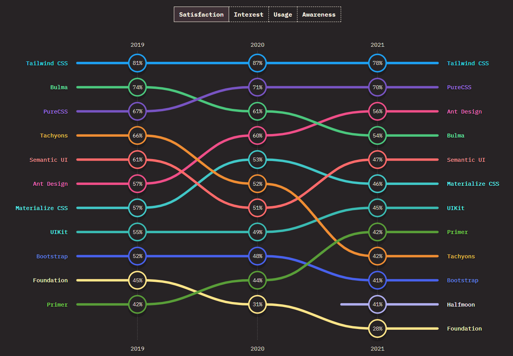
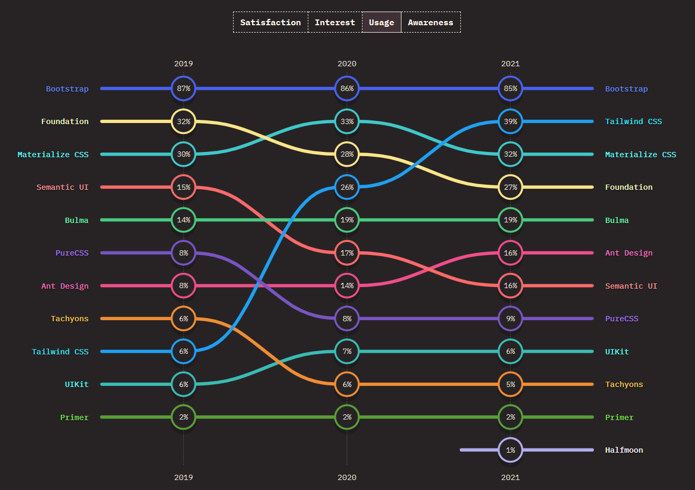

## Intro

**CSS**는 HTML 요소들의 표시 방법을 기술하기 위한 스타일 시트 언어입니다. CSS가 없다면 HTML 요소들의 스타일을 하나하나 따로 지정해주어야 합니다.(똑같은 내용과 똑같은 스타일을 가진 요소들이어도 말이죠.) CSS가 있음으로써 우리는 더욱 빠르게 요소들의 스타일을 지정해줄 수 있을 뿐만 아니라, 스타일의 일관성과 유지보수 면에서도 큰 이점을 가질 수 있습니다.

그럼에도 불구하고, 웹 개발자들이 더 효과적으로 코드를 작성하기 위해 Spring, Express, Vue.js, React 등과 같은 프레임워크(React는 프레임워크가 아니지만...)를 사용하듯이 CSS도 개발자들이 UI를 손쉽게 구현하기 위하여 **CSS 프레임워크**를 사용합니다.

오늘은 CSS 프레임워크 중 하나인 **Tailwind CSS**에 대하여 이야기해보자 합니다.

## Tailwind CSS


Tailwind CSS의 공식홈페이지에서는 **HTML을 벗어나지 않고도 웹사이트를 빠르게 구축할 수 있다.**라고 말합니다.

Tailwind CSS에서는 HTML요소의 style을 클래스명에 작성함으로써 HTML요소와 CSS를 하나의 파일에서 작성합니다. 그리고 모든 HTML, JavaScript 구성 요소 등의 class를 검색하고 해당 스타일을 생성한 다음 정적 CSS 파일에 작성하여 작동합니다. 그렇기 때문에 위에서 말했듯이 HTML과 CSS를 오가며 작성하지 않고도 웹사이트를 구축하는 것이 가능하다는 것입니다!

그렇다면 어떻게 클래스명에 HTML요소의 style을 담는지 아래에서 알아보도록 하겠습니다!

### Installation

작성방법을 배우기 전에, 우선 설치방법을 알아보겠습니다. Tailwind CSS를 install하는 방법에는

- Tailwind CLI
- PostCSS Plugin
- Framework에 설치
- CDN 사용하기

이렇게 4가지가 있습니다. 그 중에 PostCSS Plugin으로 설치하는 방법으로 진행해보도록 하겠습니다!

> tailwindcss와 peer dependency들을 설치하고, `tailwind.config.js`파일을 생성합니다.

```js
npm install -D tailwindcss postcss autoprefixer
npx tailwindcss init
```

> `postcss.config.js`파일에 tailwindcss와 autoprefixer를 추가합니다.

```jS
// postcss.confing.js
module.exports = {
  plugins: {
    tailwindcss: {},
    autoprefixer: {},
  }
}
```

> `tailwind.config.js` 파일에 template files의 경로들을 추가합니다.

```js
// tailwind.config.js
module.exports = {
  content: ["./src/**/*.{html,js}"],
  theme: {
    extend: {},
  },
  plugins: [],
}
```

> 메인 CSS 파일에 `@tailwind directives`를 추가합니다.

```css
@tailwind base;
@tailwind components;
@tailwind utilities;
```

이제 Tailwind utility style class들을 HTML 요소들에 추가함으로써 빠르게 UI를 개발할 수 있습니다!

## 작성법

Tailwind CSS는 Bootstrap처럼 태그의 클래스에 미리 세팅되어있는 유틸리티 클래스를 넣음으로써 CSS를 작성하는 방식입니다. 예시를 보면서 알아보도록 하겠습니다.


다음과 같은 컴포넌트를 만든다고 해보겠습니다. 기본적인 HTML과 CSS를 사용해 코드를 작성하면 다음과 같습니다.

```html
<div class="chat-notification">
  <div class="chat-notification-logo-wrapper">
    
  </div>
  <div class="chat-notification-content">
    <h4 class="chat-notification-title">ChitChat</h4>
    <p class="chat-notification-message">You have a new message!</p>
  </div>
</div>

<style>
  .chat-notification {
    display: flex;
    max-width: 24rem;
    margin: 0 auto;
    padding: 1.5rem;
    border-radius: 0.5rem;
    background-color: #fff;
    box-shadow: 0 20px 25px -5px rgba(0, 0, 0, 0.1), 0 10px 10px -5px rgba(0, 0, 0, 0.04);
  }
  .chat-notification-logo-wrapper {
    flex-shrink: 0;
  }
  .chat-notification-logo {
    height: 3rem;
    width: 3rem;
  }
  .chat-notification-content {
    margin-left: 1.5rem;
    padding-top: 0.25rem;
  }
  .chat-notification-title {
    color: #1a202c;
    font-size: 1.25rem;
    line-height: 1.25;
  }
  .chat-notification-message {
    color: #718096;
    font-size: 1rem;
    line-height: 1.5;
  }
</style>
```

위와 같이 HTML과 style이 분리되어있는 긴 코드를 Tailwind CSS를 사용하면 다음과 같이 작성할 수 있습니다.

```html
<div class="p-6 max-w-sm mx-auto bg-white rounded-xl shadow-lg flex items-center space-x-4">
  <div class="shrink-0">
    
  </div>
  <div>
    <div class="text-xl font-medium text-black">ChitChat</div>
    <p class="text-slate-500">You have a new message!</p>
  </div>
</div>
```

HTML 코드에서 `.chat-notification`클래스의 style 중 Tailwind CSS와 대응되는 몇 가지를 살펴보도록 하겠습니다

- `display: flex` -> `flex`
- `max-width: 24rem` -> `max-w-sm`
- `padding: 1.5rem` -> `p-6`
- `border-radius: 0.5rem` -> `rounded-xl`
- `background-color: #fff` -> `bg-white`

처음 Tailwind CSS로 개발을 하게 되면, 기존과는 상당히 다른 클래스명때문에 적응하는데 시간이 필요합니다. '**Tailwind CSS IntelliSense**'라는 extension을 사용하면 좀 더 수월하게 익숙해질 수 있고, 익숙해지고 나면 코드 작성이 정말 쉽고 빨라지게 됩니다!

만약 원하는 스타일에 대한 클래스명을 모르겠다면 `tailwind.config.js`에 사용자 정의 스타일을 추가하거나 [Tailwind CSS Documentation](https://tailwindcss.com/docs)에서 기존 CSS style에 대한 Tailwind CSS의 유틸리티 클래스명을 확인할 수 있습니다.

## Tailwind CSS versus Bootstrap

대부분의 Frontend Engineer에게 익숙한 CSS 프레임워크로 Bootstrap이 있습니다. Bootstrap을 사용해 본 경험이 있는 개발자라면, 위의 작성방법이 익숙하게 느껴지실 것입니다.

Tailwind CSS는 **Utility-First**를 지향하기 때문에 거의 모든 종류의 여백, 패딩, 글꼴 등에 대한 클래스를 제공합니다. 그리고 Bootstrap에 비해 고유한 테마를 만드는 것이 수월하기 때문에 유연성면에서도 더 좋습니다. 또한, Bootstrap은 사용하지 않는 클래스도 모두 담아두는데 반해, Tailwind CSS는 사용하지 않는 클래스는 제거함으로써 파일 크기를 줄일 수 있습니다.

Tailwind CSS가 항상 좋은 것만은 아닙니다. 요소들을 모두 마치 인라인 스타일처럼 작성하는 Tailwind CSS 특성상 가독성이 떨이지고, 출시된 지도 오래되고 가장 popular한 Bootstrap에 비해 references도 부족하다는 단점이 있습니다.

그럼에도 불구하고, 커스텀도 쉽고 원하는 디자인을 세밀하면서도 빠르게 구현할 수 있다는 장점을 가졌기에 CSS 프레임워크들 중에서 높은 평가를 받고 있고 그런 평가에 힘입어 점점 많은 관심을 받고 있습니다!





## 참고자료

1. [Tailwind CSS](https://tailwindcss.com)
2. [Pros and Cons of Bootstrap VS Tailwind](https://blog.yudiz.com/pros-and-cons-of-bootstrap-vs-tailwind)
3. [The State of CSS 2021](https://2021.stateofcss.com/en-US/technologies/css-frameworks)