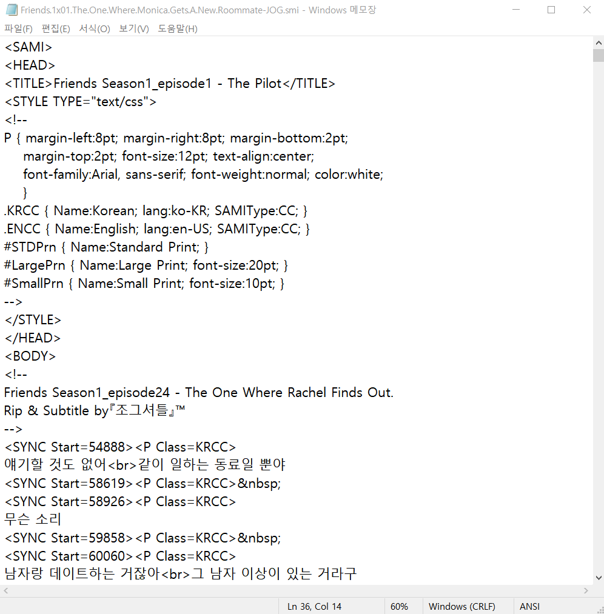
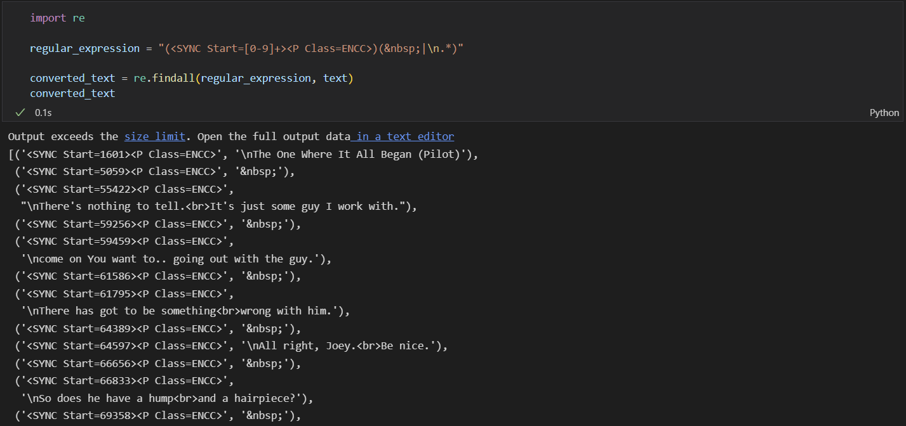

단순한 웹 크롤링이나 데이터 분석부터, 자연어 처리 모델링까지 우리는 다양한 곳에서 텍스트 데이터를 접하게 됩니다.

하지만 이러한 텍스트 데이터는 우리가 원하지 않는 특수 기호가 포함되어 있을 수도 있고, 우리가 원하는 정보 일부 만을 추출해야 할 때가 많습니다.

즉, 필연적으로 텍스트 데이터에 대한 전처리가 필요한 데, **정규 표현식**을 잘 이해하고 있으면 이를 간단하게 처리할 수 있습니다.

이러한 정규 표현식에 대해 모두 외울 필요는 없더라도, 기초적인 정규 표현식 사용법에 대해 잘 알고 있으면 대다수의 전처리가 가능하기에, 이를 간단하게 알아보고자 합니다.

(단, 정규 표현식을 실제로 적용할 때, 이용하는 라이브러리나 사전 정의에 따라 결과가 다를 수 있으니 양해 부탁드립니다.)

- - -

## **1. Basic**

가장 기본적인 형태의 정규 표현식입니다.

해당 표현식과 동일한 형태를 찾아 반환하며, 이때 대소문자를 구분합니다.

> |**정규 표현식**|**결과 예시**|
> |:---:|:---:|
> |woodchunks|interesting links to `woodchucks` and lemurs|
> |a|M`a`ry Ann stopped by Mon`a`'s|

- - -

## **2. Disjunction**

### **2-1) Bracket [ ]**

괄호 [ ]는 문자 집합을 나타내는 데 사용합니다.

괄호 안의 문자들은 or 관계라고 생각할 수 있습니다.

> |**정규 표현식**|**의미**|**결과 예시**|
> |:---:|:---:|:---:|
> |[wW]oodchunks|Woodchunk or woodchunk|`Woodchucks`|
> |[abc]|'a','b', or 'c'|In uomini, in sold`a`ti|
> |[0123456789]|any digit|plenty of `7` to `5`

### **2-2) Ranges -**

\- 문자를 이용하면 범위를 나타낼 수 있습니다.

즉, 알파벳이나 숫자를 문자 하나하나 모두 나열하지 않아도 표현이 가능합니다.

> |**정규 표현식**|**의미**|**결과 예시**|
> |:---:|:---:|:---:|
> |[A-Z]|an upper case letter|we should call it '`D`renched `B`lossoms'|
> |[0-9]|a single digit|Chapter `1`: Down the Rabbit Hole

- - -

## **3. Negation**

괄호 [ ] 안에서 첫 번째로 쓰이는 ^는 not을 의미합니다. 

원래 결과와는 반대로, 뒤에 오는 문자들이 들어있지 않은 형태를 찾습니다.

단, 괄호 [ ] 안의 첫 번째로 쓰이지 않는 ^는 문자 ^를 의미합니다.

> |**정규 표현식**|**의미**|**결과 예시**|
> |:---:|:---:|:---:|
> |[^A-Z]|not an upper case letter|O`yfn pripetchik`|
> |[e^]|either 'e' or '^'|look up `^` now|
> |a^b|the pattern 'a^b'|look up `a^b` now|

- - -

## **4. Wildcards**

### **4-1) Question mark ?**

?의 바로 직전 문자는 있던 지 없던 지 상관없도록 하여 검색합니다.

> |**정규 표현식**|**의미**|**결과 예시**|
> |:---:|:---:|:---:|
> |woodchunks?|woodchunk or woodchunks|`woodchunk`|
> |colou?r|color or colour|`color`|

### **4-2) Period .**

.가 쓰인 자리는 모든 문자와 매치가 가능합니다.

> |**정규 표현식**|**의미**|**결과 예시**|
> |:---:|:---:|:---:|
> |beg.n|any character between beg and n|`begin`, `beg'n`, `begun`|

- - -

## **5. Counters**

### **5-1) Asterisk \***

\*의 바로 직전 문자는, 아예 없거나 몇 개가 오든 상관없도록 하여 찾습니다.

> |**정규 표현식**|**의미**|**결과 예시**|
> |:---:|:---:|:---:|
> |oo*h!|0 or more of previous char|`oh!` `ooh!` `oooh!` `ooooh!`|

### **5-2) Plus \+**

\+의 바로 직전 문자는, 반드시 1개 이상 있도록 하되, 그 이상은 몇 개가 오든 상관없도록 하여 찾습니다.

> |**정규 표현식**|**의미**|**결과 예시**|
> |:---:|:---:|:---:|
> |o+h!|1 or more of previous char|`oh!` `ooh!` `oooh!` `ooooh!`|

- - -

## **6. Anchors**

### **6-1) ^**

^는 패턴의 시작을 가리킵니다.

맨 뒤에서만 찾게 됩니다.

> |**정규 표현식**|**결과 예시**|
> |:---:|:---:|
> |^[A-Z]|`P`alo Alto|
> |^[^A-Za-z]|`"`Hello"|

### **6-2) $**

$는 패턴의 끝을 가리킵니다.

맨 뒤에서만 찾게 됩니다.

> |**정규 표현식**|**결과 예시**|
> |:---:|:---:|
> |\\.$|The end`.`|
> |.$|The end`!`|

### **6-3) \b**

\b는 단어의 범위를 가리킵니다.

찾고자 하는 패턴이 단어에서 시작 또는 끝에 위치해야 하는 경우, 그 위치를 명시적으로 지정하여 찾게 됩니다.

> |**정규 표현식**|**결과 예시**|
> |:---:|:---:|
> |the|`The` o`the`rs make `the`m happy|
> |\bthe\b|`The` others make them happy|

- - -

## **7. More Disjunctions**

### **7-1) Pipe |**

|는 다수 문자열 간의 선택을 의미합니다.

or의 역할과 비슷합니다.

> |**정규 표현식**|**결과 예시**|
> |:---:|:---:|
> |yours\|mine|`yours` `mine`|

### **7-2) Parenthesis ( )**

괄호 ( )는 (와 ) 사이에 있는 문자열을 단일 문자로 간주하도록 합니다.

즉 * 또는 +를 직전 문자가 아닌 직전 패턴에 적용하고 싶은 경우 유용합니다.

> |**정규 표현식**|**결과 예시**|
> |:---:|:---:|
> |gupp(y\|ies)|`guppy` `guppies`|
> |(Column [0-9]+ \*)\*|`Colum 1 Column 2 Column 3`|

- - -

## **[실습]**

그럼 간단한 실제 문제에 적용해 볼까요?

아래와 같이 영상 자막 파일로 많이 쓰이는 smi 파일이 있습니다.

우리는 위 파일에서 각각의 **대사**와 해당 **대사가 시작하는 시간**을 추출하고 싶다고 해봅시다.

우선 해당 파일을 텍스트로 불러오면 다음과 같습니다.

여기서 **정규 표현식**을 사용하면, 아래와 같이 우리가 원하는 정보를 간단하게 추출해낼 수 있습니다.

만약 **정규 표현식**을 사용하지 않는다면, 어떠한 텍스트에서 우리가 원하는 정보를 추출해 내기 위해서 조건문과 반복문 등으로 복잡한 로직을 구현하거나, 여러 가지 다른 함수들을 동원해야 할 것입니다.

이러한 정규 표현식을 이용한 텍스트 처리는 다양한 NLP 문제나 웹 크롤링을 통한 데이터마이닝 등 매우 폭넓게 활용할 수 있습니다.
