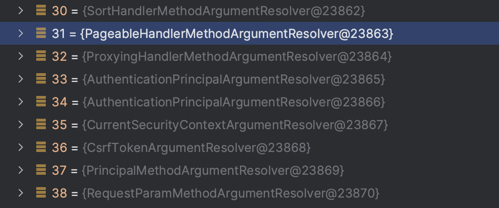

(이 글에 나오는 예시는 Kotlin을 이용해 작성하였습니다.)


# Background

Spring MVC를 사용중이라면 Controller 컴포넌트 메소드에서 다양한 방법으로 파라미터들을 주입받을 수 있다. 대표적으로는 1) `@PathVariable` `@RequestParam` 같이 Annotation Based로 주입받는 방법, 2) `Pageable` 처럼 특정 타입으로 선언하여 주입받는 방법이 존재한다. 1)와 2) 모두 이용한 컨트롤러 메소드는 다음과 같이 작성할 수 있다.

```
@GetMapping("/{id}")
fun example(
  @PathVariable id: Long,
  @RequestParam(required = false) param1: String,
  pageable: Pageable,
): String = "Hello World"
```

이 글에서는 `pageable: Pageable` 처럼 도메인 객체를 바인딩하는 방법에 대해 알아볼 것이다.


### 왜 필요할까?

사실 대부분의 객체 바인딩 방법은 기존에 이용하던 Annotation Based 로도 간단하게 할 수 있다. 위에서 작성한 `pageable: Pageable`  을 Annotation Based로 다시 작성하면 다음과 같다. 
(이해를 위해 간단하게 작성해 실제 구현과는 다를 수 있다. 실제 구현은`PageableHandlerMethodArgumentResolver` 참조 )

```
@GetMapping("/{id}")
fun example(
  @RequestParam page: Long,
  @RequestParma size: Long,
  @RequestParam sort: ...
): String {
  val _page = if (page > 0) page else DEFAULT_PAGE
  val _size = if (size > 0) size else DEFAULT_SIZE

  val pageable = PageRequest.of(_page, _size)
}
```


이렇게 작성하게 된다면 `Pageable` 객체가 필요해지는 메소드들에 동일한 로직을 적용해야 하는 등 DRY(복붙하지 마라) 라는 원칙에 위배된다.

물론 이를 Kotlin의 extension function 같은 피쳐 등을 이용해 추상화 할 수도 있겠지만, 근본적으로 
HTTP Request Valdiation과 파라미터 바인딩을 함께 할 수 있도록 Spring MVC에서 제공하는 기능을 이용하면 굉장히 깔끔해진다.


# 작동 원리

구현하기 앞서 어떻게 Spring이 컨트롤러 메소드에 특정 도메인 객체를 생성하여 바인딩 해주는지에 대해 간단하게 살펴보겠다. ( 이 과정은 도메인 객체 바인딩 뿐만 아니라 Annotation based도 동일하다. )

### HandlerMethodArgumentResolver

가장 핵심이 되는 인터페이스는 `HandlerMethodArgumentResolver` 이다. 해당 인터페이스는 두가지 method의 구현을 필요로 한다. 

1. `resolveArgument`
	- HTTP Request를 받아서 실제 resolve된 객체를 리턴해줘야하는 메소드이다.
```
Object resolveArgument(MethodParameter parameter, @Nullable ModelAndViewContainer mavContainer,  
      NativeWebRequest webRequest, @Nullable WebDataBinderFactory binderFactory) throws Exception;
```

2. `supportParameter`
	- 해당 Resolver 인터페이스가 파라미터 타입을 지원하는지 여부이다.
```
boolean supportsParameter(MethodParameter parameter);
```


### 이후 과정

해당 interface를 구현하면 스프링 Application 초기화 과정에서
`ProjectingArgumentResolverRegistrar` > `RequestMappingHandlerAdapter` >  `HandlerMethodArgumentResolverComposite`
순으로 resolver 등록이 수행된다. 

```
public void setArgumentResolvers(@Nullable List<HandlerMethodArgumentResolver> argumentResolvers) {  
   if (argumentResolvers == null) {  
      this.argumentResolvers = null;  
   }  
   else {  
      this.argumentResolvers = new HandlerMethodArgumentResolverComposite();  
      this.argumentResolvers.addResolvers(argumentResolvers);  
   }  
}
```


Spring은 컨트롤러 메소드를 `HandlerMethod` 라는 객체로 Encapsulation 해서 요청을 바인딩하는데, 이 때 `HandlerMethod` 를 상속한 `InvocableHandlerMethod` 객체에서 실제 resolver와 파라미터 객체의 바인딩이 이루어진다.
(자세한 내용은 `InvocableHandlerMethod` 클래스 참고 )

```
Object[] args = new Object[parameters.length];  
for (int i = 0; i < parameters.length; i++) {  
   MethodParameter parameter = parameters[i];  
   parameter.initParameterNameDiscovery(this.parameterNameDiscoverer);  
   args[i] = findProvidedArgument(parameter, providedArgs);  
   if (args[i] != null) {  
      continue;  
   }  
   if (!this.resolvers.supportsParameter(parameter)) {  
      throw new IllegalStateException(formatArgumentError(parameter, "No suitable resolver"));  
   }  
   try {  
      args[i] = this.resolvers.resolveArgument(parameter, mavContainer, request, this.dataBinderFactory);  
   }  
   catch (Exception ex) {  
      // Leave stack trace for later, exception may actually be resolved and handled...  
      if (logger.isDebugEnabled()) {  
         String exMsg = ex.getMessage();  
         if (exMsg != null && !exMsg.contains(parameter.getExecutable().toGenericString())) {  
            logger.debug(formatArgumentError(parameter, exMsg));  
         }  
      }  
      throw ex;  
   }  
}
```

`getMethodArgumentValues` 메소드에서 실제로 파라미터들을 받아와, 해당 파라미터를 생성해줄 Resolver들을 순회하며 실제로 바인딩을 시켜주게 된다.

해당 메소드에 breakpoint를 걸고 위에서 설명했던 예시인 `Pageable` 객체를 이용하는 컨트롤러 메소드를 실행시켜보면 다음과 같이 작동한다.




# 실제 구현해보기

위에서 언급했듯이 실제로 해야할 것은 `HandlerMethodArgumentResolver` 인터페이스를 적절하게 구현하고, 해당 구현 객체를 스프링이 인식할 수 있게 적절하게 바인딩만 해주면 된다.

여기서 구현해볼 예제는 다음과 같다.
- HTTP Header로 `X-Example-User-Id` 를 받아서
- `User` 객체로 바인딩하기
```
data class User(
  val userId: Long,
)
```

### 1. HandlerMethodArgumentResolver 구현

```
@Component  
class UserResolver : HandlerMethodArgumentResolver {  
    override fun supportsParameter(parameter: MethodParameter): Boolean {  
        return parameter.parameterType == User::class.java  
    }  
  
    override fun resolveArgument(  
        parameter: MethodParameter,  
        mavContainer: ModelAndViewContainer?,  
        webRequest: NativeWebRequest,  
        binderFactory: WebDataBinderFactory?,  
    ): Any? {  
        val request = webRequest.nativeRequest as HttpServletRequest  
        val userId = request.getHeader("X-Example-User-Id")?.toLong() ?: throw IllegalArgumentException("X-Example-User-Id header is required")  
        return User(userId)  
    }  
}
```

`supportParameter` 메소드는 파라미터 타입이 `User` 타입일때만 실행되게 하고, `resolveArgument` 메소드는 `HttpServeletRequest` 객체의 `X-Example-User-Id` 헤더를 받아와 실제 `User` 객체를 바인딩해준다.

### 2. WebMvcConfigurer 구현

Spring MVC는 MVC 관련 설정들을 편하게 관리하기 위해 `WebMvcConfigurer` 라는 인터페이스를 제공한다.
해당 인터페이스의 메소드 중 `addArgumentResolvers` 를 이용하면 직접 구현한 `HandlerMethodArgumentResolver` 인터페이스를 스프링에 등록할 수 있다.

1에서 생성한  `UserResolver` 빈을 받아다 `UserArgumentResolverConfiguration` 객체를 만들어준다.

```

@Configuration
class UserArgumentResolverConfiguration(
  private val userResolver: UserResolver,
) : WebMvcConfigurer {
	override fun    addArgumentResolvers(resolvers:MutableList<HandlerMethodArgumentResolver>) {  
	    resolvers.add(userResolver)  
	    super.addArgumentResolvers(resolvers)  
	}
}
```


### 3. 테스트

HTTP Header를 담아 요청을 해보면 다음과 같이 `User` 객체가 파라미터로 받아지는 것을 볼 수 있다.

```
curl -H "X-Example-User-Id: 123" http://localhost:8080/test
```

