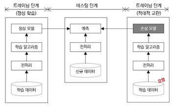

## 적대적 공격이란?

2016년 마이크로소프트의 챗봇 ‘테이(Tay)’가 16시간 만에 전격 중단되었습니다. 일부 유저들이 악의를 가지고 혐오 표현들을 학습시켜 챗봇이 각종 인종, 성차별적인 발언을 쏟아내도록 만들었기 때문입니다. 딥러닝이 발전하면서, 이와 같이 모델의 보안을 위협하는 문제는 지속되왔고, 그 위험성은 커지고 있습니다. 

위의 예시에서처럼, 기존의 해킹 방법과는 다르게, 머신러닝 알고리즘이 내제하고 있는 취약점을 이용한 방법이 바로 적대적 공격입니다. 즉, 적대적인 공격은 미세하게 변경된 입력 데이터인 적대적 예제를 활용해 신경망의 정확도를 떨어뜨리는 행위입니다.


*머신러닝 학습 과정과 적대적 공격 생성*

그림에서처럼 머신러닝은 데이터를 수집하고, 학습 데이터를 준비합니다. 이후 알맞은 머신러닝 알고리즘을 선택하여 학습 데이터를 입력해 기계를 학습시킵니다. 적대적 공격은 학습 데이터에 적대적 예제, 즉 잘못된 결과를 산출하도록 공격자가 의도적으로 조작함으로써 이루어집니다.

## 적대적 공격 유형
적대적 공격은 신경망 내부 정보 보유 여부에 따라 두 가지로 나뉩니다. white-box 공격은 신경망 내부 정보를 아는 상태로 수행하는 공격으로, 이 때문에 더욱 효과적인 공격을 수행할 수 있습니다. Black-box 공격은 반대로 신경망 내부 정보를 모르는 상태로 수행하는 공격으로, 실제 상황에서 신경망은 이 유형의 공격을 당할 확률이 높습니다.

## FSGM
대표적인 적대적 공격인 FSGM에 대해 코드를 통해 살펴보도록 하겠습니다. FSGM은 공격 목표를 정할 수 없는 non-targeted 방식이자, 대상 모델의 정보가 필요한 화이트박스 방식입니다.

공격받는 모델은 pytorch/examples/mnist 와 동일한 MNIST 모델입니다.
fgsm_attack 함수는 입력 파라미터로 3가지를 가집니다. 
  1) 원본 이미지(x)
  2) 앱실론(ε) 으로 픽셀 단위의 작은 변화를 주는 값입니다.
  3) data_grad 로 입력영상(∇xJ(θ,x,y))에 대한 변화도 손실 값입니다. 

아래 식을 바탕으로 변화가 적용된 이미지가 생성됩니다.
perturbed_image = image+epsilon*sign(data_grad) = x + ε*sign(∇xJ(θ,x,y))
공격은 동일한 역전파 기울기를 기반으로 손실을 최대화하도록 입력 데이터를 조정합니다.

```python
---------------------------------------------------------------------------------------------
#공격 실행
# FGSM 공격 코드
def fgsm_attack(image, epsilon, data_grad):
    # data_grad 의 요소별 부호 값을 얻어옵니다
    sign_data_grad = data_grad.sign()
    # 입력 이미지의 각 픽셀에 sign_data_grad 를 적용해 작은 변화가 적용된 이미지를 생성합니다
    perturbed_image = image + epsilon*sign_data_grad
    # 값 범위를 [0,1]로 유지하기 위해 자르기(clipping)를 추가합니다
    perturbed_image = torch.clamp(perturbed_image, 0, 1)
    # 작은 변화가 적용된 이미지를 리턴합니다
    return perturbed_image
---------------------------------------------------------------------------------------------
```

공격을 직접 실행한 결과는 다음과 같습니다.


여기서 전체 테스트 스텝을 각 엡실론(Ɛ) 값에 실행합니다. Ɛ=0인 경우 공격이 없는 원본 테스트 정확도를 의미합니다. 위 그래프에서 엡실론이 증가할수록 테스트 정확도는 떨어집니다.

## 적대적 방어
위에서 살펴본 적대적인 공격을 막아내는 방법이 바로 적대적 방어입니다. 적대적 방어는 크게 적대적 학습과 전처리 기법으로 구분됩니다. 먼저, 적대적 학습은 적대적 예제를 학습 데이터셋에 포함시켜 신경망을 재학습시키는 방법입니다. 이를 통해 적대적 예제에 대한 신경망의 예측 성능을 높일 수 있습니다. 다음으로 전처리 기법은 적대적 예제를 사전에 탐지하는 적대적 탐지 기법과 입력 데이터에 포함된 노이즈를 제거하는 디노이징으로 나눌 수 있습니다.

적대적 공격에 대한 방안은 현재에도 연구되고 있는 분야이며, 완벽한 해결책은 아직까지도 존재하지 않습니다. 따라서 인공지능 서비스를 이용할 때에는 잠재적인 취약점이 존재한다는 사실을 잊지 않고, 모델이 오염되지 않도록 꾸준히 관리하는 방안이 필요합니다. 
